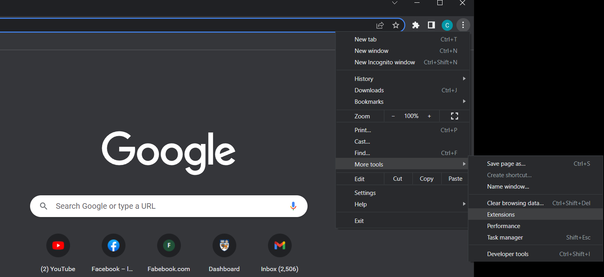
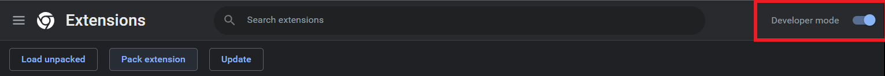
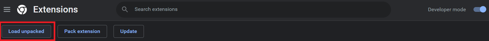
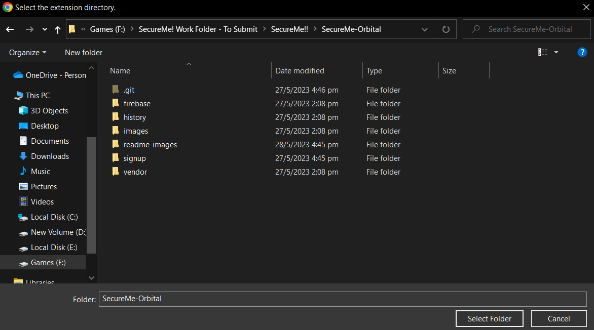
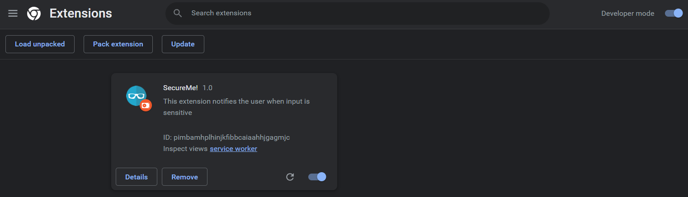
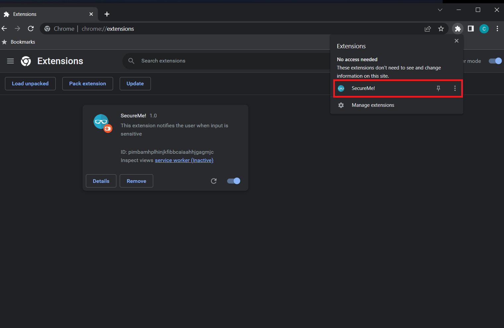
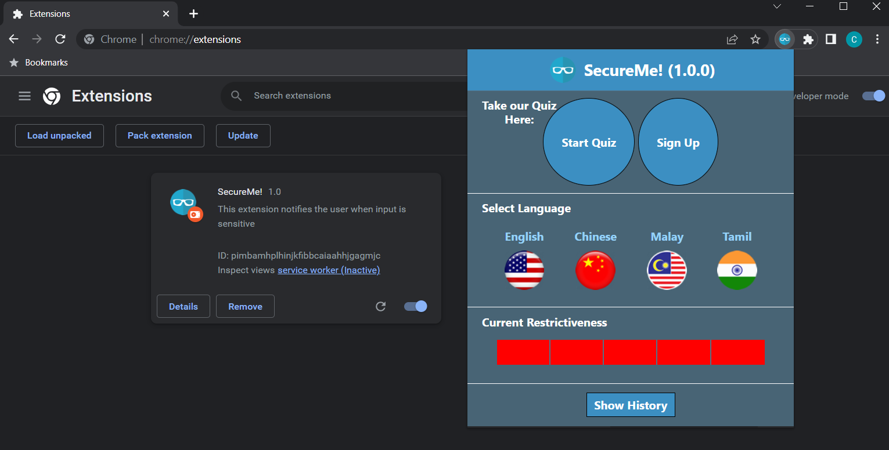

# SecureMe

SecureMe is an accessible and intuitive browser extension that aids in keeping internet users safe from the potential hazards of the Internet.

## Getting Started

### Dependencies

* Google Chrome Browser : https://www.google.com/chrome/?brand=YTUH&gclid=Cj0KCQjw98ujBhCgARIsAD7QeAiG7rxn3mkN9GxZBd9nd1C9_sfD7rjMvQFZRVXiK-OIhenj8gweRcEaAikQEALw_wcB&gclsrc=aw.ds

### How to Set-Up

1. Proceed to the Extensions Menu as shown in the Image Below :   
  
2. In the Extensions Menu, ensure that Developer mode is Toggled On :   
  
3. Select Load unpacked  
  
4. Select folder containing project files. In this case, it should be SecureMe-Orbital  
  
5. Your Page should look like this if SecureMe! is successfully loaded in  
  
6. On the top-right of the Browser, Select the Extensions Icon -> Click on the SecureMe! Extension  
  
7. If the previous steps are done correctly, you should see SecureMe's popup and the extension is ready to be used.  
  

## Current Features 

### Fake Website Detector
* Current Issues : Only a couple of websites have been added. Do refer to the 'blacklist.js' file to see the possible fake sites you can try
* Description : When visiting these websites, the extension should be able to detect that you are on a blacklisted site, providing the user with a prompt along with a suggestion to be redirected to the correct site

### Website Input Detectors
* Current Issues : NIL. Do inform us of bugs and issues should you come accross any
* Description : Detect input fields in a website and prompts to users of potential submissions of sensitive information. The categories of inputs which would be detected can be found in 'common.js'. Prompts can be clicked again to be removed should it be intrusive

### History Logger
* Current Issues : Does not work for all sites
* Description : When a user has submitted information via input fields online, the extension tracks the website, inputs submitted along with the date and time in the history page

### Quiz
* Current Issues : Getting the First and Second Question does not do anything
* Description : A Quiz page for users. Provides services according to the questions they have gotten right/wrong

### Facebook Chat Keyword Detector
* Description : Detects certain words such as "card", "phone number" and would show a popup with a reminder message to users

### Sign up and Login
* Current Issues : Sign-up and Login Page still accessible even though User is already Logged-In 
* Description : Standard Sign-up and Login, which redirects you to a welcome page upon successful sign-up / login 

### Multi-Language Support
* Description : User should be able to select a language which they want their reminders to be in

## Further Info to the Project
https://docs.google.com/document/d/1M-8ewBqkf7GK9fOESR7_7Lvfgm_xpCRubro3Olv3iEo/edit?usp=sharing

## Authors

